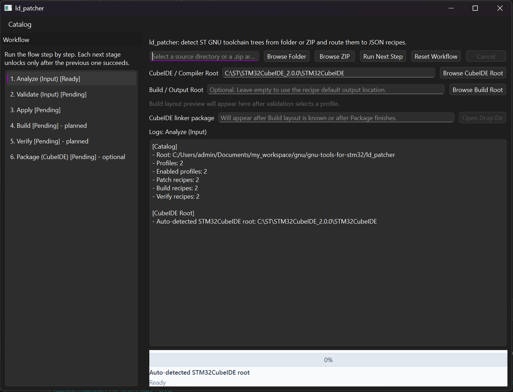

# ld_patcher

`ld_patcher` is a Qt-based patch/build/verify tool for producing patched GNU `ld` builds from ST `gnu-tools-for-stm32` sources.

It is built around a JSON catalog:

- profiles decide routing
- patch recipes decide compatibility
- build recipes define how to build
- verify recipes prove the produced linker works

The current implementation supports the full end-to-end workflow:

- `Analyze`
- `Validate`
- `Extract` for ZIP input
- `Apply`
- `Build`
- `Verify`
- `Package (CubeIDE)`

## Contents

- [Documentation Map](docs/DOCUMENTATION_MAP.md)
- [Prerequisites](docs/PREREQUISITES.md)
- [Manual Workflow](docs/MANUAL_WORKFLOW.md)
- [CLI Reference](docs/CLI_REFERENCE.md)
- [CubeIDE Integration](docs/CUBEIDE_INTEGRATION.md)
- [Manual Patch Package](docs/MANUAL_PATCH_PACKAGE.md)
- [Adding Support For A New Compiler Version](docs/ADDING_SUPPORT.md)
- [Linker JSON Contract](docs/LINKER_JSON_CONTRACT.md)
- [Workspace Cleanup](docs/WORKSPACE_CLEANUP.md)

## Start Here

If you only need one answer to "what should I open first?", use this:

1. if you want to use the program with the least thinking:
   - open [Documentation Map](docs/DOCUMENTATION_MAP.md)
   - then open [Prerequisites](docs/PREREQUISITES.md)
   - then open [Manual Workflow](docs/MANUAL_WORKFLOW.md) or just use the GUI
2. if you want to work from the command line:
   - open [Prerequisites](docs/PREREQUISITES.md)
   - open [CLI Reference](docs/CLI_REFERENCE.md)
3. if you want to do the whole patch by hand without the GUI:
   - open [Prerequisites](docs/PREREQUISITES.md)
   - open [Manual Patch Package](docs/MANUAL_PATCH_PACKAGE.md)
   - then open [Manual Workflow](docs/MANUAL_WORKFLOW.md)
4. if you want to plug the finished linker into STM32CubeIDE:
   - open [Prerequisites](docs/PREREQUISITES.md)
   - open [CubeIDE Integration](docs/CUBEIDE_INTEGRATION.md)
5. if you want to add support for a new ST release:
   - open [Prerequisites](docs/PREREQUISITES.md)
   - open [Adding Support For A New Compiler Version](docs/ADDING_SUPPORT.md)

## If You Have Never Used A Terminal

You can still use this repository. The docs use a few repeated terms:

- `PowerShell`
  - the normal Windows command console used in this repository for `.ps1` commands
- `MSYS2 MINGW64 shell`
  - the Unix-like shell used to build the patched linker itself
- `working tree`
  - the extracted ST source directory that you are patching
- `drop dir`
  - the build output directory containing the finished linker binaries
- `package dir`
  - the final CubeIDE-ready folder that you point CubeIDE at through `-B".../"`

If a document shows placeholders like:

- `<profile-id>`
- `<working-root>`
- `<drop-dir>`

that means you must replace them with real values from your own machine.

The beginner-safe order is:

1. keep the whole `ld_patcher` folder together
2. use the GUI first if you can
3. if you need command-line work, copy commands from [CLI Reference](docs/CLI_REFERENCE.md)
4. if you need to patch everything manually, copy commands from [Manual Workflow](docs/MANUAL_WORKFLOW.md)

## What You Need Before Anything Else

For normal patch/build/verify work you need:

- one supported ST source ZIP or extracted source tree
- STM32CubeIDE or another `arm-none-eabi` compiler for the verify step
- MSYS2/MinGW64 for the host-side linker build

For just reading the docs or preparing patch payloads by hand, you do not need
to build `ld_patcher.exe` first.

Full dependency and installation guidance lives in:

- [Prerequisites](docs/PREREQUISITES.md)

## What The Patch Does

`ld_patcher` does not simply rebuild ST's linker unchanged.
It patches ST's `src/binutils/ld` sources so the resulting GNU `ld` can emit a structured JSON dump of the resolved link state.

At a high level, the patch:

- adds the internal JSON implementation files into `src/binutils/ld`
- extends the linker option tables so the patched linker accepts the JSON dump option set
- injects runtime glue into `ldlang.c` so JSON export runs after the final linker layout is known
- extends `Makefile.am` so the added patch files are part of the source/build flow
- keeps the final binaries usable as a drop-in linker package for STM32CubeIDE

The emitted JSON exposes linker state in a machine-readable form instead of forcing downstream tools to scrape `.map` files or linker diagnostics.

The current self-contained verify flow checks the canonical top-level JSON payload:

- `format`
- `output`
- `memory_regions`
- `output_sections`
- `input_sections`
- `discarded_input_sections`
- `symbols`

In practice, this gives you structured access to:

- the resolved entry symbol
- linker memory regions
- final output sections
- input sections and their placement
- discarded input sections
- linker-visible symbols

## Why This Exists

The patch exists to make ST's `gnu-tools-for-stm32` linker observable and automation-friendly.

This is useful when you want to:

- inspect the final linker layout programmatically
- validate linker-script behavior without reverse-parsing `.map` files
- compare toolchain revisions or linker-script changes
- feed linker results into custom tooling, visualizers, regression checks, or diagnostics
- generate a ready-to-copy patched linker package for STM32CubeIDE instead of maintaining ad-hoc binaries by hand

`ld_patcher` is aimed at ST's `gnu-tools-for-stm32` source packages, not at arbitrary upstream GNU Arm toolchain trees.

## Current Support

Locally verified:

- `gnu-tools-for-stm32-13.3.rel1.zip`
- `gnu-tools-for-stm32-14.3.rel1.zip`

Active profiles:

- `st_gnu_tools_for_stm32_13_3_rel1_20250523_0900`
- `st_gnu_tools_for_stm32_14_3_rel1`

Active build recipes:

- `msys2_mingw64_st_ld_13_3_verified`
- `msys2_mingw64_st_ld_14_3_verified`

Active verify recipes:

- `sanity_cli`
- `json_smoke_self_contained`

## Supported ST Source Packages

Official upstream for the supported source snapshots:

- STMicroelectronics `gnu-tools-for-stm32`:
  - https://github.com/STMicroelectronics/gnu-tools-for-stm32

Currently supported and locally verified source packages:

- `gnu-tools-for-stm32-13.3.rel1.zip`
  - source tree:
    - https://github.com/STMicroelectronics/gnu-tools-for-stm32/tree/13.3.rel1
  - source ZIP:
    - https://github.com/STMicroelectronics/gnu-tools-for-stm32/archive/refs/tags/13.3.rel1.zip
- `gnu-tools-for-stm32-14.3.rel1.zip`
  - source tree:
    - https://github.com/STMicroelectronics/gnu-tools-for-stm32/tree/14.3.rel1
  - source ZIP:
    - https://github.com/STMicroelectronics/gnu-tools-for-stm32/archive/refs/tags/14.3.rel1.zip

Notes:

- the supported input snapshots are the official ST source archives/tags above
- after detection or build, ST's fuller display version may include an additional release stamp such as `13.3.rel1.20250523-0900`
- package naming inside `ld_patcher` is based on the real working-tree name, not only on the profile display string

## UI Preview

Current `ld_patcher` GUI:

## Documentation

One current documentation set lives in:

- [Documentation Map](docs/DOCUMENTATION_MAP.md)

Primary documents:

- [Prerequisites](docs/PREREQUISITES.md)
- [Manual Workflow](docs/MANUAL_WORKFLOW.md)
- [CLI Reference](docs/CLI_REFERENCE.md)
- [CubeIDE Integration](docs/CUBEIDE_INTEGRATION.md)
- [Manual Patch Package](docs/MANUAL_PATCH_PACKAGE.md)
- [Adding Support For A New Compiler Version](docs/ADDING_SUPPORT.md)
- [Linker JSON Contract](docs/LINKER_JSON_CONTRACT.md)
- [Workspace Cleanup](docs/WORKSPACE_CLEANUP.md)

If you want the shortest explanation of what each document is for:

- [Documentation Map](docs/DOCUMENTATION_MAP.md)
  - which document to read first
- [Prerequisites](docs/PREREQUISITES.md)
  - what to install before GUI, CLI, manual build, verify, or source build
- [Manual Workflow](docs/MANUAL_WORKFLOW.md)
  - exact no-GUI/manual commands, with inline scripts and expected results
- [CLI Reference](docs/CLI_REFERENCE.md)
  - exact `ld_patcher.exe` commands and what each argument means
- [CubeIDE Integration](docs/CUBEIDE_INTEGRATION.md)
  - exact `-B".../"` hookup inside STM32CubeIDE
- [Manual Patch Package](docs/MANUAL_PATCH_PACKAGE.md)
  - exact payload files, insertion points, and expected source code after insertion
- [Adding Support For A New Compiler Version](docs/ADDING_SUPPORT.md)
  - maintainer cookbook for adding a new ST version
- [Linker JSON Contract](docs/LINKER_JSON_CONTRACT.md)
  - the canonical output shape expected from `--dump-script-json`

Manual helper scripts live in:

- [scripts/manual_reference/](scripts/manual_reference/)

These manual helpers are wired to the same current payload packages and
self-contained verify assets used by the application workflow, and the same
current script contents are embedded inline in [Manual Workflow](docs/MANUAL_WORKFLOW.md).

Reference sample outputs live in:

- [docs/reference_samples/](docs/reference_samples/)

## What Lives Inside `ld_patcher`

Everything needed for the active patch/build/verify flow is kept inside `ld_patcher`:

- `catalog/`
  - authoritative catalog index, schemas, profiles, and recipes
- `payloads/`
  - patch payload packages used by active patch recipes
- `scripts/`
  - helper scripts used by verify and build-related recipes
- `verify_assets/`
  - self-contained smoke-test sources and linker script
- `third_party/libzip`
  - vendored `libzip` source

The active workflow no longer depends on:

- old numbered workspace build folders
- old external patch-package folders
- any external STM32 sample project

The workspace-specific documentation and manual knowledge now live directly
inside this repository in the canonical docs and [`scripts/manual_reference/`](scripts/manual_reference/)
layout, so they no longer need to remain scattered across old helper folders.

External tools still needed at runtime:

- the source archive or source tree that you want to patch
- STM32CubeIDE or an `arm-none-eabi` compiler for the verify step
- MSYS2/MinGW64 for host-side linker build

`ld_patcher` can bootstrap the MSYS2 build environment automatically when needed.

## Runtime Model

`ld_patcher` reads its own data files from the filesystem, not from a Qt `.qrc` bundle.

It looks for:

- `catalog/catalog.json`
- `payloads/`
- `scripts/`
- `verify_assets/`

starting from:

- the current working directory
- then the application directory
- then parent directories

This means the standard development layout works out of the box:

- `ld_patcher/build/.../release/ld_patcher.exe`
- with the real catalog and payload data still living under the repo-local `ld_patcher/`

Important portability note:

- the built `release/` folder contains Qt runtime DLLs/plugins and `libzip.dll`
- but it does **not** currently copy `catalog/`, `payloads/`, `scripts/`, and `verify_assets/` into `release/`

So today the safe portable unit is:

- the whole `ld_patcher` folder

not just:

- `ld_patcher/build/.../release`

If you want to move `ld_patcher` to another machine without rebuilding it, copy the full `ld_patcher` directory.

## Workflow

The GUI workflow is step-gated. A step becomes available only after the previous one succeeds.

### Directory Input

For a directory input:

- `Analyze (Input)`
- `Validate (Input)`
- `Apply`
- `Build`
- `Verify`
- `Package (CubeIDE)`

`Extract` is skipped.

`Apply` warns before modifying the directory in place.

### ZIP Input

For a ZIP input:

- `Analyze (Input)`
- `Validate (Input)`
- `Extract`
- `Analyze (Working Tree)`
- `Validate (Working Tree)`
- `Apply`
- `Build`
- `Verify`
- `Package (CubeIDE)`

For ZIP input, the user chooses:

- the parent extraction folder
- the extracted working-directory name

This avoids collisions with previous attempts and keeps the mutable workflow on a real directory tree.

## Logs And Status UI

The GUI keeps:

- per-step logs in the right-hand log browser
- per-step status/progress snapshots in the bottom status panel

When you select a workflow item on the left:

- the log browser shows only logs for that step
- the bottom status panel restores the saved progress/state for that same step

Current progress behavior:

- `Extract` uses real file-based percent
- `Analyze`, `Validate`, and `Apply` use internal progress milestones
- `Build` uses stage-based progress, not true compiler percent
- `Verify` can use more detailed progress when the verify script emits `LDPATCHER_PROGRESS ...`

`Apply` also emits detailed live logs for each patch operation, including:

- operation index
- operation type
- source/target paths
- backup creation
- copy/insert/append results
- post-apply validation confirmation

## Build / Output Layout

The default build root is:

- `<working_root>/build`

unless the user overrides it in the GUI.

The build preview shows:

- `Build dir`
- `Install dir`
- `Verify drop dir`
- `CubeIDE package dir`

The build step produces:

- a build tree
- an install tree
- a drop directory used by verify

The final `Package (CubeIDE)` step creates a ready-to-copy package directory in the style:

- `_cubeide-arm-linker-st-13.3.rel1-jsonpatch`
- `_cubeide-arm-linker-st-14.3.rel1-jsonpatch`

Package naming is based on the real working-tree name, not only on the profile display name.

The package currently contains:

- `ld.exe`
- `ld.bfd.exe`
- `arm-none-eabi-ld.exe`
- `arm-none-eabi-ld.bfd.exe`
- `libwinpthread-1.dll`
- `libzstd.dll`

## Verify Model

The default verify flow is self-contained inside `ld_patcher`.

It no longer depends on any external STM32 example project.

Bundled smoke-test inputs live under:

- `verify_assets/self_contained_smoke/`

The verify step looks for `arm-none-eabi-g++.exe` in this order:

- `STM32_GCC`
- `PATH`
- the GUI field `CubeIDE / Compiler Root`
- standard `C:\ST` installs
- standard `C:\Program Files\STMicroelectronics` installs

On startup, the GUI also tries to auto-fill the newest STM32CubeIDE install it can find.

## Building `ld_patcher`

Use:

- `ld_patcher/build_ld_patcher.ps1`

Examples:

- release:
  - `powershell -ExecutionPolicy Bypass -File .\ld_patcher\build_ld_patcher.ps1`
- debug:
  - `powershell -ExecutionPolicy Bypass -File .\ld_patcher\build_ld_patcher.ps1 -Configuration Debug`
- both:
  - `powershell -ExecutionPolicy Bypass -File .\ld_patcher\build_ld_patcher.ps1 -Configuration Both`
- force fresh `libzip` rebuild:
  - `powershell -ExecutionPolicy Bypass -File .\ld_patcher\build_ld_patcher.ps1 -ForceLibzip`
- clean:
  - `powershell -ExecutionPolicy Bypass -File .\ld_patcher\build_ld_patcher.ps1 -Configuration Release -Clean`

### What the build script does

The build script:

- resolves the active Qt build directory
- resolves `qmake`, `mingw32-make`, and `windeployqt`
- uses existing qmake-generated makefiles when possible
- rebuilds makefiles only when needed
- lets the qmake build invoke `ensure_libzip.ps1`
- deploys Qt runtime with `windeployqt`

`libzip` build artifacts live in:

- `build/<qt-build-dir>/libzip-shared`

Runtime copies live in:

- `build/<qt-build-dir>/release/`
- `build/<qt-build-dir>/debug/`

### Build-script behavior notes

`Release` is the primary portable runtime output.

`Debug` also builds successfully, but standalone debug deployment may still be limited by the installed Qt kit.

If `windeployqt` fails for `Debug` because debug plugins are missing, the script now:

- keeps the build successful
- warns that standalone debug deployment is not available

This does not affect the normal `Release` output.

## Direct Qt Creator / qmake builds

If you build directly in Qt Creator or by running `mingw32-make` yourself:

- `ensure_libzip.ps1` is still wired in as a pre-target dependency
- `libzip.dll` and `zlib1.dll` are prepared automatically

For a fully portable `Release` runtime, the bootstrap script is still the recommended path because it also runs `windeployqt`.

## Catalog Layout

- `catalog/catalog.json`
  - authoritative index
- `catalog/schemas/`
  - schemas for profiles, recipes, and result objects
- `catalog/profiles/`
  - supported source-tree profiles
- `catalog/recipes/patch/`
  - patch recipes and anchor checks
- `catalog/recipes/build/`
  - build recipes
- `catalog/recipes/verify/`
  - verify recipes

`catalog/catalog.json` is authoritative:

- only indexed JSON files are loaded
- extra files in the tree are ignored until indexed

Profiles and recipes may be disabled with:

- `"enabled": false`

## Patch Model

There is no single opaque patch script.

Patch logic is split into:

1. JSON patch recipe:
   - describes required files, anchor checks, operations, and idempotency checks
2. payload package:
   - contains the real files and code fragments used by those operations

Active payload packages currently live under:

- `payloads/json_patch_v10_st_ld_13_3_rel1_20250523_0900`
- `payloads/json_patch_v10_st_ld_14_3_rel1`

The engine is not hard-wired to these names.
It follows the patch recipe data:

- payload roots
- required files
- operation types
- target/source paths

The current manual workflow uses these same payload packages as its source of
truth rather than maintaining a second external patch bundle.

## CLI

The CLI uses the same backend as the GUI.

- detect:
  - `ld_patcher.exe --detect <source-dir-or-zip>`
- validate:
  - `ld_patcher.exe --validate <source-dir-or-zip>`
- extract:
  - `ld_patcher.exe --extract <zip> <parent-dir> <directory-name>`
- apply:
  - `ld_patcher.exe --apply <profile-id> <working-root>`
- build:
  - `ld_patcher.exe --build <profile-id> <working-root> [build-recipe-id] [build-root-override]`
- verify:
  - `ld_patcher.exe --verify <profile-id> <drop-dir> [cubeide-path]`
- package:
  - `ld_patcher.exe --package <source-drop-dir> <package-dir>`

Full CLI reference:

- [CLI Reference](docs/CLI_REFERENCE.md)

If you want to add support for a new ST version:

- [Adding Support For A New Compiler Version](docs/ADDING_SUPPORT.md)

## Current Limitations

- `Build` progress is stage-based, not true compiler percent.
- `Package (CubeIDE)` is still implemented in C++ code, not yet as a fully JSON-driven package recipe.
- The `release/` runtime folder alone is not yet fully self-contained because app data stays under the main `ld_patcher` tree.
- If you want a future fully portable dist package, the next logical step is to copy:
  - `catalog/`
  - `payloads/`
  - `scripts/`
  - `verify_assets/`
  into the deployed runtime folder or a dedicated `dist/` directory.

## Practical Summary

If you just want to use the tool:

1. build `Release`
2. run `ld_patcher`
3. open a supported ST `gnu-tools-for-stm32` ZIP or directory
4. walk through the workflow:
   - `Analyze`
   - `Validate`
   - `Extract` if needed
   - `Apply`
   - `Build`
   - `Verify`
   - `Package (CubeIDE)` if you want the final ready-to-copy linker folder

If you want to move it to another machine right now:

- copy the whole `ld_patcher` folder

That is the safest transfer unit today.

